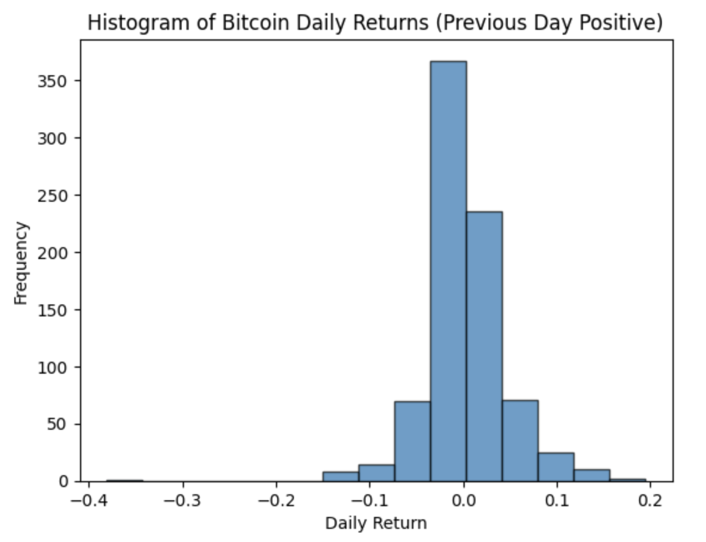

# 📈 Bitcoin Price vs. Fear & Greed Index and S&P 500 — A Data Analysis Project
This project explores the relationship between Bitcoin (BTC) price movements, the Fear and Greed Index, and the S&P 500 Index. Through descriptive statistics, time series analysis, return modeling, and linear regression, we uncover how investor sentiment and market trends influence BTC returns.

## 🔍 Overview
The analysis includes:

Descriptive statistics and correlation analysis

Time series visualization of BTC, Fear and Greed Index, and S&P 500

Daily return analysis of BTC, including distribution fitting and statistical testing

Linear regression models to predict BTC returns using sentiment and market indicators

## 📊 Key Findings
1. Descriptive Statistics & Correlation Analysis
Summary statistics were computed for BTC price, the Fear and Greed Index, and S&P 500 prices.

A correlation matrix revealed moderate positive correlation between BTC and the S&P 500.

2. Time Series Analysis

Visualized trends in BTC price, Fear and Greed Index, and S&P 500 over time.

Calculated and plotted 30-day moving averages for BTC and S&P 500 to highlight trends and reduce noise.

3. BTC Daily Return Analysis

Calculated daily returns and explored their distribution.

Fitted a Gaussian distribution and ran normality tests (Shapiro-Wilk, Levene’s).

Analyzed BTC returns conditional on previous one and two days’ returns.

Found statistically significant differences in returns based on the previous two-day pattern using t-tests, Mann-Whitney U, and Kolmogorov-Smirnov tests.

4. Fear & Greed Index Analysis

Categorized the Index into: Extreme Fear, Fear, Neutral, Greed, Extreme Greed.

Analyzed the return distributions under each sentiment category.

Kolmogorov-Smirnov tests confirmed statistically significant differences in BTC returns across sentiment levels.

5. Relationship with S&P 500
Calculated correlations between BTC returns and lagged S&P 500 changes.

Visualized relationships with scatter plots to identify patterns.

Analyzed joint impact of sentiment and market movement on BTC returns.

6. Linear Regression Modeling

Developed a simple linear regression model using lagged Fear and Greed Index to predict BTC returns.

Extended the model to include both the Fear and Greed Index and S&P 500 changes.

Used PyTorch to train and evaluate models, with results visualized using 2D and 3D plots.

Residual analysis provided insights into model fit and assumptions.

## 🧠 Tools & Libraries Used
Python (Pandas, NumPy, Matplotlib, Seaborn, SciPy, Statsmodels, Scikit-learn, PyTorch)

Jupyter Notebooks

Data Sources: BTC historical price data, CNN Fear & Greed Index, S&P 500 Index data

